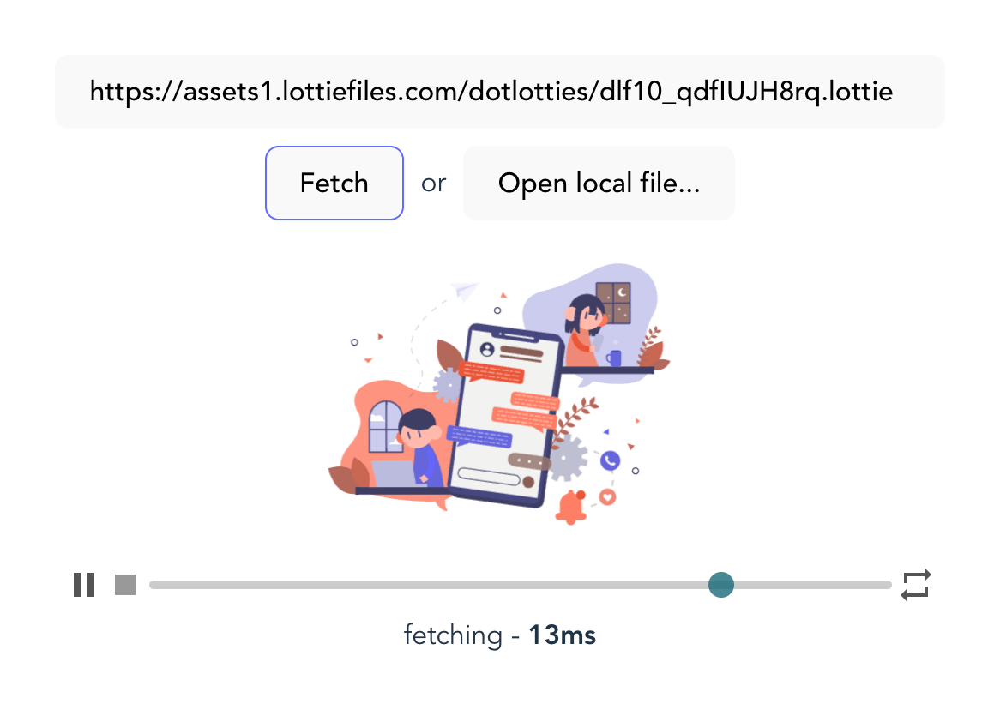

# dotLottie-player-core

Only fetching and parse functions.

[](https://www.npmjs.com/package/@reslear/dotlottie-player-core)


[](https://packagephobia.com/result?p=@reslear/dotlottie-player-core)
[](https://github.com/semantic-release/semantic-release)



<center>

🕹 [**Live Playground**](https://dotlottie-player-core-playground.vercel.app)

</center>

## Features

- 🏎 High performance (using [`fflate`](https://github.com/101arrowz/fflate))
- ⚙️ [Fetch API](https://developer.mozilla.org/en-US/docs/Web/API/Fetch_API) based
- 📦 **CJS** and **ESM** support
- 💪 fylly typed with **TypeScript**

## Install

```bash
pnpm add @reslear/dotlottie-player-core
```

## Usage

### fetchLottie

fetch method for get animation and parse to lottie json.

```ts
import { fetchLottie } from '@reslear/dotlottie-player-core'

const lottieJson = await fetchLottie('/my-animation.lottie')

// {"v":"5.6.8","fr":24,"ip":0,"op":144,"w":2161,"h"...}
```

#### Arguments:

1. **`url`** - path to `.lottie`, `.json` animation file

also support [base64 data URI](https://developer.mozilla.org/en-US/docs/Web/HTTP/Basics_of_HTTP/Data_URLs)

```ts
fetchLottie('data:application/json;base64,<base64>')
```

2. **`fetchOptions`** - Fetch API [options](https://developer.mozilla.org/en-US/docs/Web/API/fetch#options)

```ts
fetchLottie(url, {
  mode: 'no-cors',
})
```

## Inspired

- [dotlottie-player](https://github.com/dotlottie/player-component/blob/master/src/dotlottie-player.ts)

## License

MIT by [@reslear](github.com/reslear)
